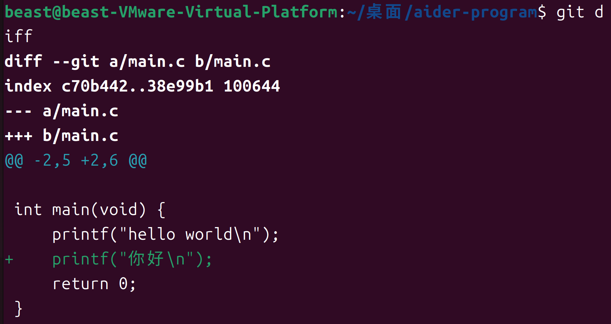

# 任务 1

## 使用了什么 Agent
使用本地代码 Agent 工具 Aider‑chat，大模型后端：`deepseek/deepseek‑flash`。

## 安装和配置过程
- 安装 aider‑chat，配置 DeepSeek API‑key。
- 本机存在系统代理环境变量，会引发网络、鉴权报错；使用 `env -i` 清空代理变量后启动程序，解决网络异常。
- 踩坑：混淆命令行参数与 yaml 配置字段，错误写 `no‑git: true` 配置不生效；yaml 正确字段为 `git: false`。
- 本次实验采用命令行参数 `--no‑git`，完全关闭 Aider 的 Git 自动能力，禁止自动 `git add`、自动 commit，所有版本操作由使用者手动完成。

## 你交给了它什么任务
编辑 C 语言文件 `main.c`，在原有 HelloWorld 输出基础上，增加一行中文打印输出。

## Agent 做了哪些修改
Agent 读取磁盘上已有的 `main.c`，在 `main()` 函数体内新增一行打印代码；仅修改本地磁盘文件，不操作 Git 暂存区，不自动生成 commit。

## git diff 中你看到了什么
git diff结果如下：

## 最终结果是否符合你的预期
符合预期。Agent 正确完成代码修改；关闭 Git 自动集成后不会自动产生提交记录，改动可以通过 git diff 正常查看；编译运行程序，可正常输出 hello world 和 你好，程序运行正常。
